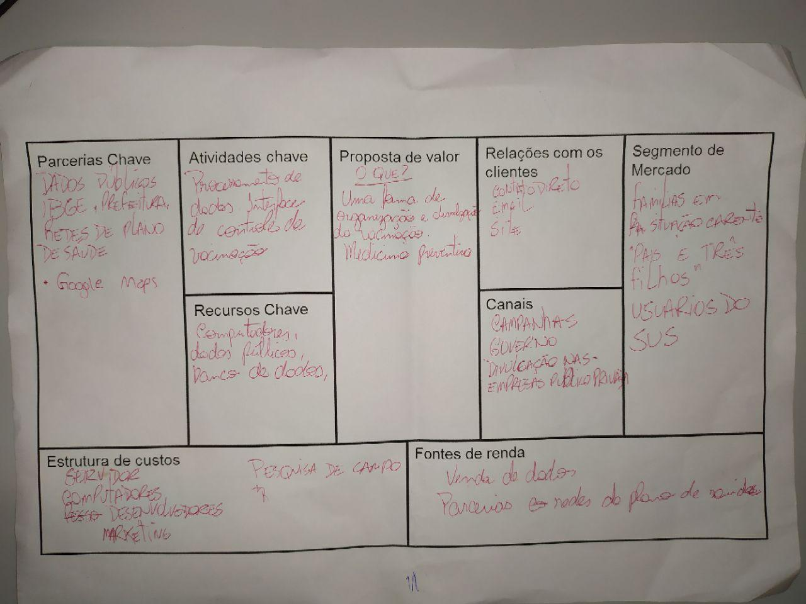
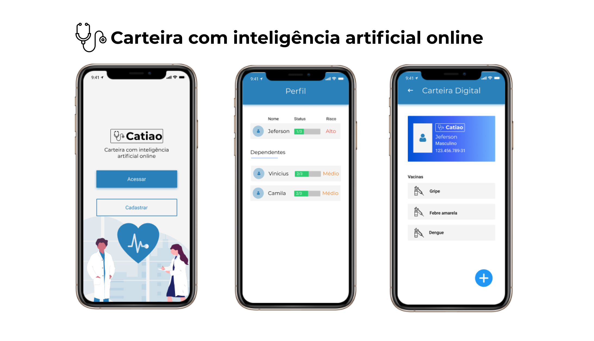

# Catiao

## Sobre o projeto

Carteira com inteligência artificial online

Surgiu-se a ideia de uma startup de auxiliar as pessoas em monitorar a carteira de vacina.
Com isso, auxiliamos na redução de doenças epidemiologicas.

## Quem somos

A startup catiao surgiu através de um hackatoon na Fatec zona sul, nos unimos para uma causa e percebemos o quão longe iriamos
Desenvolvemos a ideia em um dia, e apartir daí estamos desenvolvendo o produto e impulsionando o projeto.

- Jeferson Silva B. : UI Designer
- Vinicius Pereira : Developer
- Alexander Ju : Marketing
- Rodolfo Rodrigues : Vendas
- Camilla Chaves : Marketing

## Canvas

## Interface

[Veja todas interfaces e prótipo](https://www.figma.com/proto/2S387jGqArf6LhbimXxfZ3/Hackathon-AFZS?node-id=1%3A4&scaling=scale-down)

## Demo

[Website Catiao](https://catiao.epizy.com)
